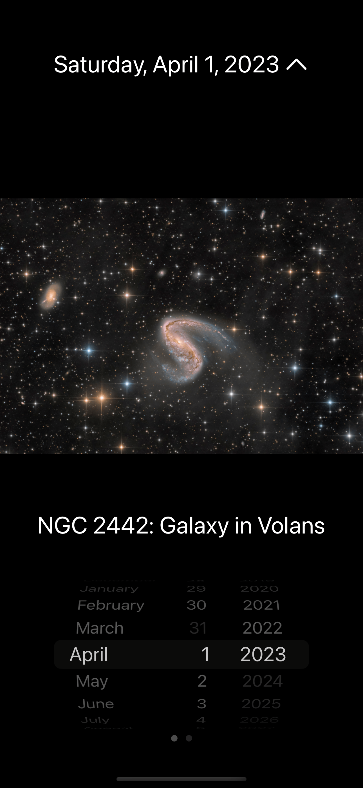
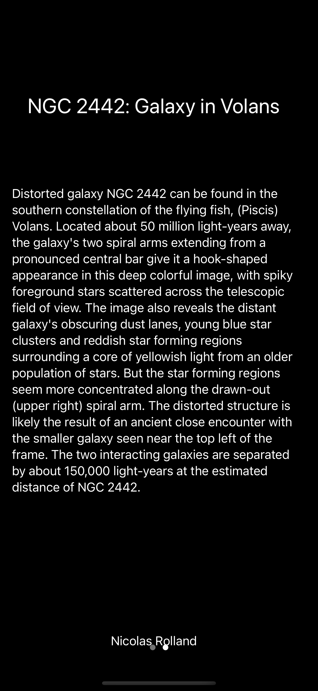
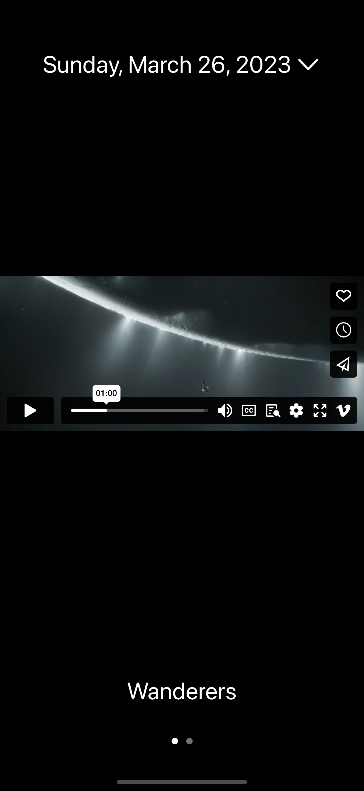
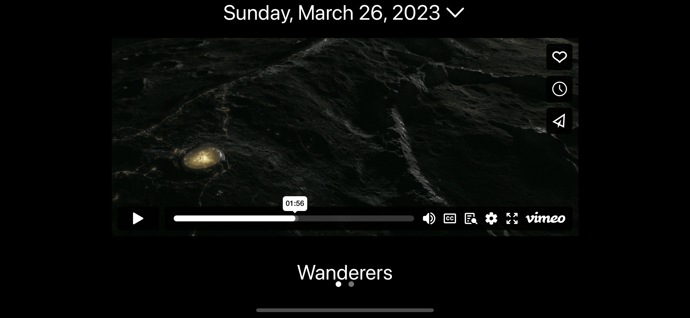

# APODApp: Astronomy Picture of the Day Viewer

[](LICENSE)

## Introduction

APODApp is an immersive iOS application that provides a daily window to the cosmos using NASA's Astronomy Picture of the Day API. It merges stunning space visuals with educational content to spark curiosity and learning about our universe. This project is designed with a focus on clean architecture and user experience, highlighting both robust functionality and an elegant interface.

## Installation

### Prerequisites

- Xcode 14 or newer
- iOS 16 or newer for testing on a device

### Running the Project

To run this project, follow these steps:

```bash
git clone https://github.com/ddeerrrriicckk/APODApp.git
cd APODApp
open APODApp.xcodeproj
```

## Features

- **Daily APOD Updates**: Discover a new view of the universe every day with fresh content delivered through NASA's API.

- **Historical Exploration**: A built-in calendar allows users to journey back in time to explore previous APODs all the way back to 1995.

- **Rich Media Experience**: Enjoy high-definition images and stream videos within the app, with full pinch-to-zoom functionality for a closer look at the cosmos.

- **Smart Caching**: Automatically saves images for offline access and minimizes data usage without any setup required from the user.

- **Dark Mode UI**: A dark theme not only saves battery life but also enhances the vividness of space imagery, making each star and galaxy pop.

## Objectives

- Integrate NASA's APOD API into a mobile platform to provide daily educational content.
- Offer a responsive and intuitive interface for users to explore astronomical phenomena.
- Utilize modern iOS development practices to ensure a seamless and fluid user experience.

## Functionality

- Fetch and display new APOD imagery and information each day.
- Navigate through historical APOD entries using a date picker.
- Support for viewing both images and videos within the app.
- Present detailed explanations and titles for each APOD entry.

## Project Structure

The APODApp consists of several key components that together create a comprehensive user experience:


#### `APODViewModel.swift`
Manages the presentation layer of the app, coordinating between the view and the model. It utilizes the Combine framework for reactive updates and SwiftUI for the user interface.

#### Key Features

- **ObservableObject ViewModel**: Maintains the state of the APOD view, updating the UI upon data changes.

- **Published Properties**: Uses `@Published` properties to trigger UI updates automatically.

- **Network Communication**: Handles API calls to fetch new APOD data and manage error states.

- **Date Management**: Provides functions to fetch previous and next APOD entries based on the selected date.

#### Example Code
This excerpt from `APODViewModel.swift` showcases the reactive data handling:

```swift
class APODViewModel: ObservableObject {
    
    @Published var apod: APOD?
    @Published var errorMessage: String?
    
    // ... other properties and functions ...

    func fetchAPODData(for date: Date) {
        // Implementation for fetching APOD data
    }
    
    // ... other methods ...
}
```

#### `NetworkManager.swift`
Handles all network-related tasks, such as building requests and parsing responses from the APOD API.

#### Key Features
- **API Communication**: Manages the construction of network requests and handles the responses.

- **Error Handling**: Includes comprehensive error handling to deal with network issues and data parsing errors.

- **Async Operations**: Utilizes Swift's concurrency features to perform network operations asynchronously.

#### Example Code
Here's a snippet from `NetworkManager.swift` illustrating the network request handling:

```swift
class NetworkManager {
    
    func fetchAPODData(date: String, completion: @escaping (Result<APOD, APIError>) -> Void) {
        // Implementation for fetching data from the API
    }
    
    // ... Additional methods ...
}
```

## Design and Implementation
The APODApp embraces a modern and minimalist design approach, providing a user experience that is both visually appealing and functional.

- **Modern Design**: A clean and intuitive UI that aligns with the latest iOS design trends.

- **Dark Mode**: Enhances the visual appeal of space images and provides a comfortable viewing experience in low-light conditions.

- **MVVM Architecture**: Promotes a clear separation of concerns for better maintainability and scalability.

## Screenshots
<p style="display: flex; justify-content: space-between;">
  
  
  
</p>
<p style="text-align: center;">
  
</p>
